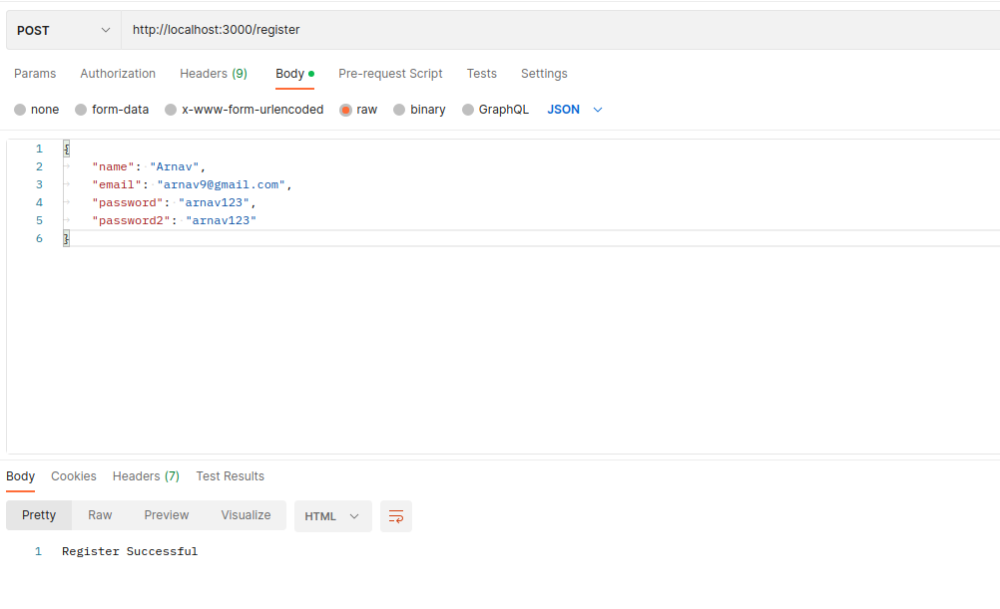
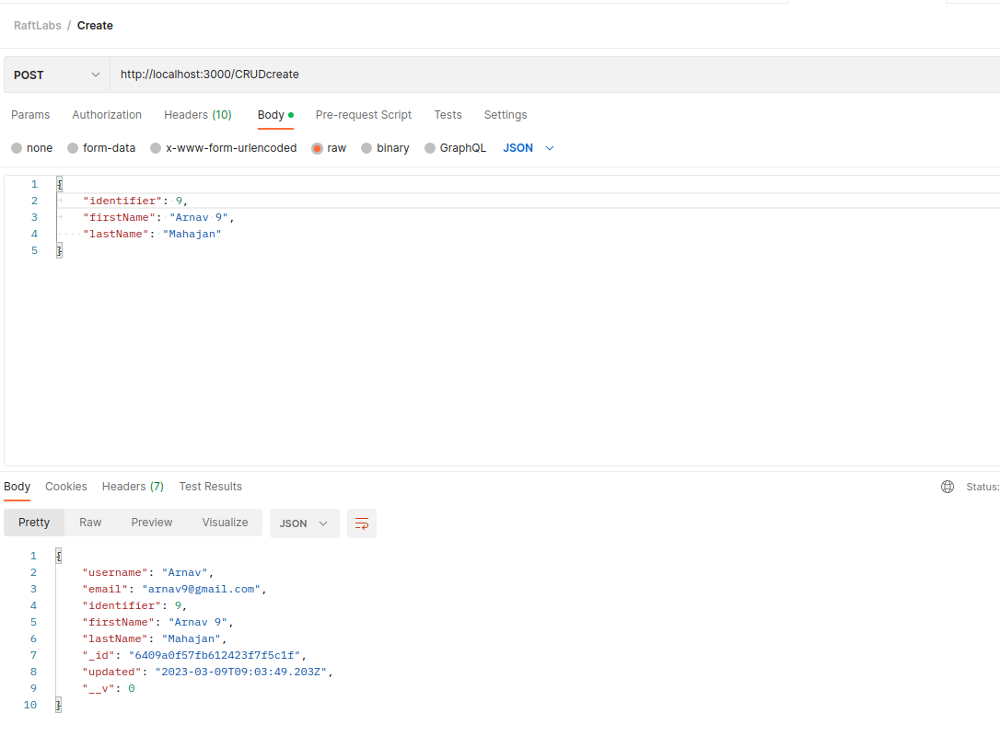

# RaftLabs

<p align="center">
  <h2 align="center">RaftLabs - Task 1 - CRUD Operations - JWT Authentication and Authorization</h3>
</p>

<!-- TABLE OF CONTENTS -->

<details open="open">
  <summary>Table of Contents</summary>
  <ol>
    <li>
      <a href="#about-the-project">About The Project</a>
      <ul>
        <li><a href="#framework-used">Framework Used</a></li>
      </ul>
    </li>
    <li>
      <a href="#getting-started">Getting Started</a>
      <ul>
        <li><a href="#prerequisites">Prerequisites</a></li>
        <li><a href="#installation">Installation</a></li>
      </ul>
    </li>
    <li><a href="#usage">Usage</a></li>
    <li><a href="#walkthrough">Walkthrough</a></li>
  </ol>
</details>

<!-- ABOUT THE PROJECT -->

## About The Project

This project is built in **`node js`** with **`mongodb`** as backend. It provides following capability through API interface:

1. Authentication and authorization using JWT tokens.
2. Input validation and error handling to ensure data integrity and prevent attacks.
3. Integration with a database - MongoDB.
4. Pagination and sorting of resources to enable efficient querying and browsing.
5. Caching of frequently accessed resources to improve performance and reduce
   load on the database.
6. API to perform CRUD operations on above collection

The above API are using `jsonwebtoken` package for basic authentication to manage access

### Framework/Environment Used

Here are the major framworks/environment which were used in the project

- [Nodejs](https://nodejs.org/en/)
- [NPM package Manager](https://www.npmjs.com/)
- [Mongo DB](https://www.mongodb.com/)
- [Postman](https://www.postman.com/)

<!-- GETTING STARTED -->

## Getting Started

The following sections helps in installing the project and the prerequisties required for the same.
The prerequisites and the installation guide are as follow:-

### Prerequisites

The local machine should have **Node js**, **Postman** and **MongoDB** installed

- npm
  ```sh
  npm install npm@latest -g
  ```
- postman
- mongodb

### Installation

1. Clone the repo
   ```sh
   git clone https://github.com/ArnavMahajan01/RaftLabs-CRUD.git
   ```
2. Install NPM packages
   ```sh
   npm install
   ```
3. Make a `.env` file and inside the file enter the desired Port number, Mongoose cluster path and a auth token
   ```
   DB_CONNECT = "YOUR PATH"
   PORT = "YOUR PORT"
   VERIFY_AUTH_TOKEN = "YOUR AUTH TOKEN"
   ```

<!-- USAGE -->

## Usage

In this section, the structure and the project flow is described.

1. The project is divided into various section. There is a _**`middleware`**_ folder along with _**`controller`**_, _**`routes`**_ and _**`models`**_. The `other` directory contains the images and the video walkthrough of the application. The `middleware` contains all the necessary middlewares like auth and cache system. The `controller` and `routes` contains are responsible for handling incoming requests and returning responses to the client to a particular endpoint. The `models` contains the schemas for the mongodb

   

2. Various API's are called which help in acheiving various function. Like `http://localhost:3000/register` helps in creating a new user and pushing the user's data into Mongoose. Similarly `http://localhost:3000/CRUDcreate`, `http://localhost:3000/CRUDread`, `http://localhost:3000/CRUDupdate`, `http://localhost:3000/CRUDdelete` helps in other CRUD operations CREATE, READ, UPDATE, DELETE respectively.

2.1 API outputs for User Authentication and Authorization
These API will help user authentication and authorizations with the help of **JWT Tokens**




2.2 API for CRUD operations
Following are the API for the crud operations

2.2.1 For CRUD-Create

2.2.2 For CRUD-Read


2.2.3 For CRUD-Update


2.2.4 For CRUD-Delete


## Walkthrough

[Watch Video Here](https://drive.google.com/drive/folders/1d6HA3bnco58vFc0oKXnSKtk3VfCR1cxP?usp=share_link)
